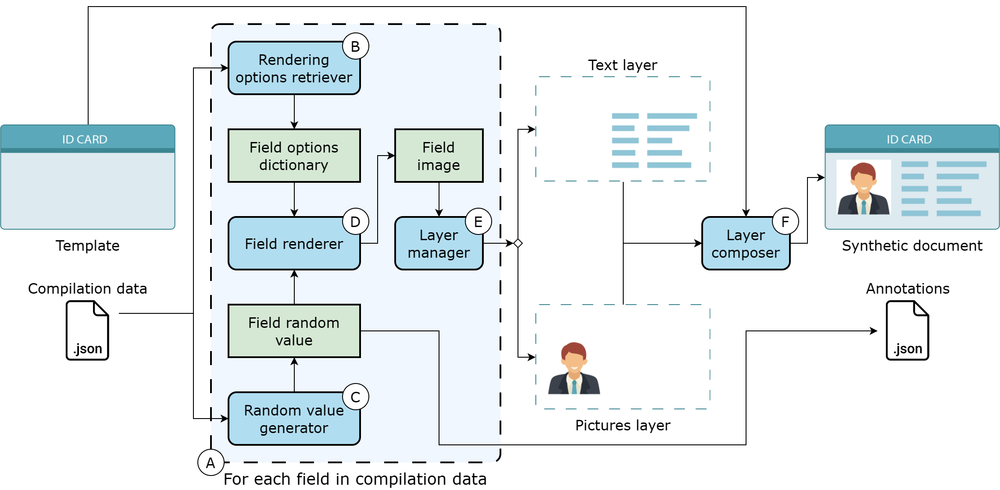

# Synthetic ID Generator Framework

This repository hosts the codebase from the paper ***An End-to-End OCR-Free Solution For Identity Document Information
 Extraction***.

## Codebase

This repository provides a ***Python* implementation for a synthetic ID-card generation pipeline**. The core objective
 of this pipeline is to **create synthetic images of personal identification documents (ID cards) to serve as additional
 training data in document information extraction tasks**.

The pipeline takes as input an ID card empty template and the information about how to complete it (supported by proper
 Python functions) and generates the final document along with the textual field annotations.

The following is a visual representation of how the pipeline works, though it is better explained in the paper.

<p align="center">
  
</p>

## Download model and dataset

This pipeline has been used in the aforementioned paper ***An End-to-End OCR-Free Solution For Identity Document
 Information Extraction***. It generated a set of synthetic ID cards to serve as pre-training data to fine-tune a
 [Donut](https://github.com/TheWover/donut) model in a document information extraction task. You can download the synthetic dataset and fine-tuned
 model [on Zenodo](https://zenodo.org/records/11084995).

## Running the pipeline

Our implementation uses [Wand](https://docs.wand-py.org/en/latest/guide/install.html) to write text over the templates. You need [ImageMagick](https://imagemagick.org/script/download.php) to run it properly.

You have to install some custom fonts we used, which you can find in the [`template/fonts`](/synthid/templates) folder.

The face pictures we use to compile the templates come from the [Face Research Lab London Set](https://figshare.com/articles/dataset/Face_Research_Lab_London_Set/5047666). We use the
 [neutral front faces](https://s3-eu-west-1.amazonaws.com/pfigshare-u-files/8541961/neutral_front.zip) as those better-fit ID cards. You can manually download it and place the images in the
 [face_pictures template](/synthid/templates/face_pictures) folder or run the [download script](/synthid/templates/download_face_pictures) on Linux and WSL.

Create a Python environment (`Python>=3.10`) and install the [`requirements`](/requirements.txt):
```bash
pip install -r requirements.txt
```

Finally, you have to fix a problem with one of our dependencies. Our implementation uses [Augraphy](https://augraphy.readthedocs.io/en/latest/index.html) and its [low
 light noise augmentation](https://augraphy.readthedocs.io/en/latest/doc/source/augmentations/lowlightnoise.html). We faced a `NameError` using the [`LowLightNoise`](https://github.com/sparkfish/augraphy/blob/4132722b839cc272737defc1f17c552595c55033/augraphy/augmentations/lowlightnoise.py#L24) class because two variables
 were referenced without ever being declared, as this happens inside an `if` statement. We fixed the problem by moving
 [their declaration](https://github.com/sparkfish/augraphy/blob/4132722b839cc272737defc1f17c552595c55033/augraphy/augmentations/lowlightnoise.py#L163-L165) outside the `if` statement.


### Supported documents
The pipeline allows for the synthetic generation of 4 types of Italian ID cards.

#### [Paper Identity Document template](synthid/templates/documents/paper-id)

<span>&emsp;</span>

  
#### [Electronic Identity Document template](synthid/templates/documents/paper-id)

<span>&emsp;</span>


#### [Health Card template](synthid/templates/documents/health-card)

<span>&emsp;</span>


#### [Driving License template](synthid/templates/documents/drv-license)

